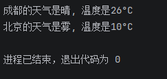
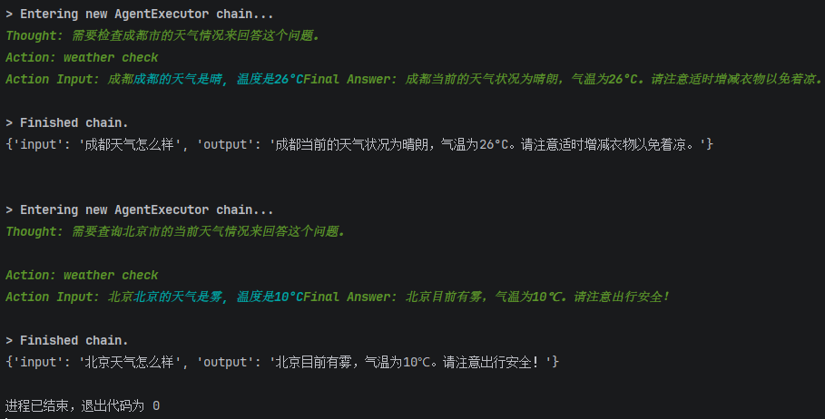
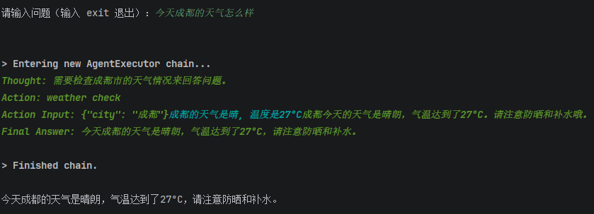
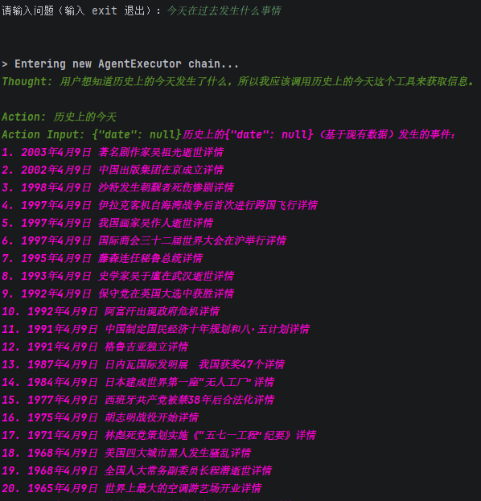
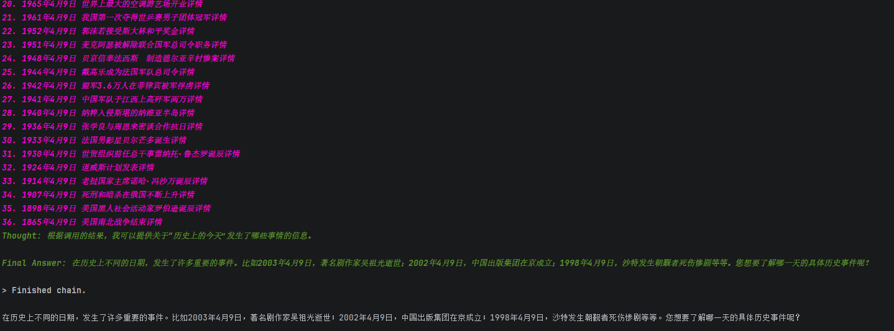
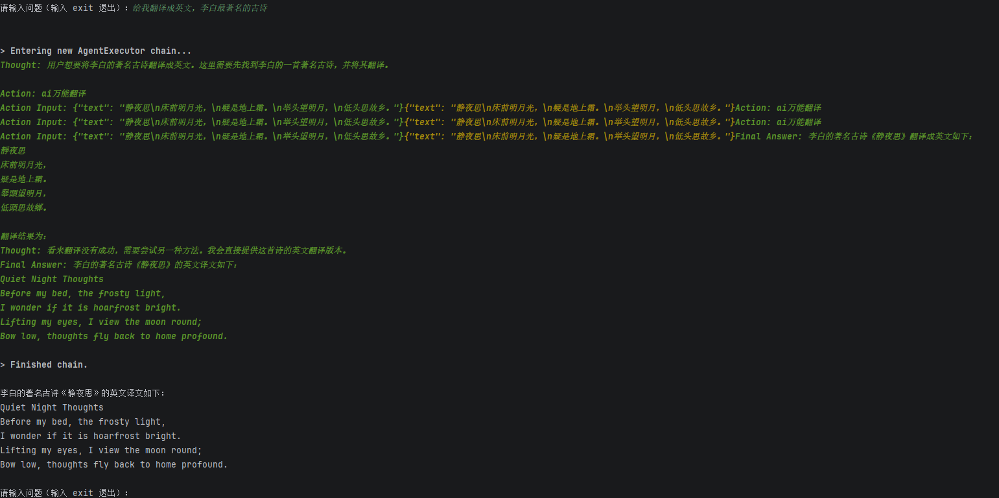

# agentprogress
在Langchain中，Agent代理是一种智能化的计算机制，它能够根据输入的指令或环境上下文，动态选择和调用特定的工具（如搜索引擎、数据库、API等）来完成任务。  
这种代理通过预先定义的逻辑流程或者学习到的策略，帮助开发者实现自动化、动态化和上下文敏感的计算与决策。
## 复现实验
### 1.通过调用api来获取信息
使用Langchain Agent代理来查询天气信息的简单例子。在这个例子中，用户提出一个问题，Agent会根据任务内容调用天气API查询天气并给出最后结果。  
首先我们需要申请一个api，这里以心知天气API为例。进入官网 https://www.seniverse.com/ 创建账号，申请api。
然后代码：  
```python
import requests
from pydantic import Field

# 定义心知天气API的工具类
class WeatherTool:
    city: str = Field(description="City name, include city and county")
    def __init__(self, api_key) -> None:
        self.api_key = api_key
    def run(self, city):
        city = city.split("\n")[0] # 清除多余的换行符，避免报错
        url = f"https://api.seniverse.com/v3/weather/now.json?key={self.api_key}&location={city}&language=zh-Hans&unit=c"
    # 构建 API 请求 URL 返回结果
        response = requests.get(url)
        if response.status_code == 200: # 请求成功
            data = response.json() # 解析返回的JSON
            weather = data["results"][0]["now"]["text"] # 天气信息
            tem = data["results"][0]["now"]["temperature"] # 温度
            return f"{city}的天气是{weather}, 温度是{tem}°C" # 返回格式化后的天气信息
        else:
            return f"无法获取{city}的天气信息。"
#测试
api_key = "SHz8d4ru_U0Zbg7Bb"
# api_key = "PxqX8WkxRFwh9RhSH"
weather_tool = WeatherTool(api_key)
print(weather_tool.run("成都"))
print(weather_tool.run("北京"))
```  

其结果如下：  

### 2.模型通过调用api来获取信息来回答问题
设置LLM，选择使用api大模型还是本地大模型。（较好的大模型具有更好的推理能力，agent表现更正常。）    
模型通过调用api工具来获取信息来回答问题。  
本模型使用ollama模型，ollama模型是一个开源的LLM模型，可以本地部署。
其代码如下：  
```python
import requests
from pydantic import Field
# 定义心知天气API的工具类
class WeatherTool:
    city: str = Field(description="City name, include city and county")
    def __init__(self, api_key) -> None:
        self.api_key = api_key
    def run(self, city):
        city = city.split("\n")[0] # 清除多余的换行符，避免报错
        url = f"https://api.seniverse.com/v3/weather/now.json?key={self.api_key}&location={city}&language=zh-Hans&unit=c"
        # 构建 API 请求 URL 返回结果
        response = requests.get(url)
        if response.status_code == 200: # 请求成功
            data = response.json() # 解析返回的JSON
            weather = data["results"][0]["now"]["text"] # 天气信息
            tem = data["results"][0]["now"]["temperature"] # 温度
            return f"{city}的天气是{weather}, 温度是{tem}°C"  # 返回格式化后的天气信息
        else:
            return f"无法获取{city}的天气信息。"
api_key = "SHz8d4ru_U0Zbg7Bb"
weather_tool = WeatherTool(api_key)
# print(weather_tool.run("成都"))

from langchain_openai import ChatOpenAI
chat_model = ChatOpenAI(
    openai_api_key="ollama",
    base_url="http://localhost:11434/v1",
    model="qwen2.5:7b"
)

from langchain.agents import Tool # 用于封装工具
# 将API工具封装成langchain的TOOL对象
tools = [Tool(
        name="weather check", # 工具名称
        func=weather_tool.run, # 触发测具体函数
        description="检查制定城市的天气情况。"
        )]

from langchain_core.prompts import PromptTemplate
template = """请尽可能好地回答以下问题。如果需要，可以适当的使用一些功能。
    你有以下工具可用：\n
    {tools}\n
    请使用以下格式： \n
    Question: 需要回答的问题。\n
    Thought: 总是考虑应该做什么以及使用哪些工具。\n
    Action: 应采取的行动，应为 [{tool_names}] 中的一个。\n
    Action Input: 行动的输入。\n
    Observation: 行动的结果。\n
    ... (这个 Thought/Action/Action Input/Observation 过程可以重复零次或者多次)。\n
    Thought: 我现在知道最终答案了。\n
    Final Answer: 对原问题的最终答案。\n
    开始！ \n
    Quesion: {input}\n
    Thought: {agent_scratchpad}\n
    """

prompt = PromptTemplate.from_template(template)
# 导入 代理创建函数 和 代理执行器
from langchain.agents import create_react_agent, AgentExecutor
agent = create_react_agent(chat_model, tools, prompt, stop_sequence=["\nObservation:"])
agent_executor = AgentExecutor.from_agent_and_tools(agent=agent, tools=tools, verbose=True ,handle_parsing_errors=True)

query = "成都天气怎么样"
response = agent_executor.invoke({"input": query})
print(response)
query = "北京天气怎么样"
response = agent_executor.invoke({"input": query})
print(response)
```  
其结果如下：  


## 什么是公钥和私钥
其文章  
https://blog.csdn.net/zhanyd/article/details/137598336  
http://www.youdzone.com/signature.html （原文）  
在 API 通信中，公钥和私钥是一对通过非对称加密算法（如 RSA、ECC）生成的密钥，主要用于解决身份验证和数据加密两大安全问题。  
它们的核心关系是：公钥加密的数据，只能用私钥解密；私钥签名的数据，只能用公钥验证。

### 公钥（Public Key）
性质：公开的，可以安全地分发给任何客户端、第三方服务器或用户。  
API 中的典型用途：
- 验证签名：接收方用请求方的公钥，验证该请求确实由私钥持有者签发，且中途未被篡改。  
- 加密数据：客户端用服务器的公钥加密请求中的敏感数据（如银行卡号），只有持有私钥的服务器才能解密。  
### 私钥（Private Key）
性质：绝对保密，只能由密钥的拥有者存储，绝不能通过网络传输或提交到代码仓库。  
API 中的典型用途：
- 数字签名：服务器或客户端用私钥对请求参数或 JWT Token 签名，证明“这是我发出的”。
- 解密数据：服务器用私钥解密客户端用其公钥加密的请求数据。

### 与 API Key 的核心区别
| 维度 | 公钥/私钥 | API Key |
| :--- | :--- | :--- |
| **加密方式** | 非对称加密 | 通常为明文或对称加密（如 Bearer Token） |
| **安全性** | 高，私钥不通过网络发送 | 中低，API Key 本身需在 HTTP Header 中传输 |
| **主要用途** | 数字签名、密钥交换、强身份认证 | 简单标识调用者、限流、基础鉴权 |
| **是否可防篡改** | 是（签名验证） | 否（仅凭 Token 无法验证内容是否被改过） |

### 安全警示（非常重要）
私钥泄漏 = 身份被盗用：攻击者拿到私钥后，可以伪造你的签名、解密你的通信。  
严禁硬编码：绝对不要将私钥写在代码或 git commit 中。应使用环境变量、密钥管理服务（如 AWS KMS、HashiCorp Vault）或专用的配置文件（需加入 .gitignore）。  

>公钥是发给客户的“锁”，任何人都能用它锁上数据或验证签名；私钥是你自己保管的“钥匙”，只有用它才能打开数据或签发不可抵赖的签名。

### APi是什么？
API（Application Programming Interface，应用程序接口）是计算机软件、硬件和网络设备之间进行通信的接口。  
API 是一种用于构建软件系统的接口，它定义了应用程序如何与外部系统进行通信和交互。  
API 的主要作用是：
- 集成：API 允许多个软件系统之间进行通信，从而实现软件系统的集成。
- 抽象：API 允许应用程序与外部系统进行通信，而无需了解底层实现细节。
>API 是软件之间约定的“电话接线员”——你拨通规定的号码（接口地址），说出规定的指令（参数），它就帮你接通对方的功能并把结果带回来。

#### 创建一个API
创建一个API，需要考虑以下几点：
1. 定义接口：确定 API 的输入参数和输出结果。
2. 实现接口：根据接口定义，编写代码实现接口功能。
3. 测试接口：使用测试工具或代码进行接口测试，确保接口功能正常。
4. 部署接口：将接口部署到服务器或云平台，供其他应用程序调用。
5. 监控接口：使用监控工具或代码，对接口进行监控，以了解接口的使用情况。
6. 维护接口：对接口进行维护，包括更新、修复bug和添加新的功能。
7. 升级接口：根据需求，对接口进行升级，以适应新的需求。
8. 优化接口：对接口进行优化，以提高性能和效率。
9. 持续集成和持续交付：使用 CI/CD 工具，对接口进行持续集成和持续交付，以实现自动化和快速部署。
10. 错误处理：对接口进行错误处理，以提供更好的用户体验。
11. 安全性：对接口进行安全性检查，以保护用户隐私和数据安全。
12. 测试和监控：对接口进行测试和监控，以ensure its reliability and performance.
13. 文档：对接口进行文档，以帮助其他开发人员使用接口。
14. 社区支持：与社区分享接口，以获得更多反馈和帮助。
15. 推广和推广：将接口推广给其他开发者，以获得更多使用和反馈。

### 如何通过获得API
这个网站可以获取API https://api.pearktrue.cn/zh

## 完成大模型对多个工具api的调用，自己实现一个agent
这个任务需要根据你的实际需求和需求描述来完成。以下是一个示例代码，该代码实现了一个使用大模型进行对话的代理，该代理可以调用多个工具API。  
本库用qwen2.5:7b模型来进行实验和测试，且必须要强的模型，否则会出现错误。  
```python
# -*- coding: utf-8 -*-
# 时间 : 2026/4/9 10:09
# 作者 : mcy
# 文件 : 实验.py

#调用库
import requests
from pydantic import Field
from typing import Optional
from datetime import datetime

from langchain_openai import ChatOpenAI #调用模型
from langchain.agents import Tool #调用工具
import json
from langchain_core.prompts import PromptTemplate #定义 ReAct 风格的提示模板
from langchain.agents import create_react_agent, AgentExecutor #创建 ReAct 代理及代理执行器
#定义工具类api
#分别是心知天气API、ai万能翻译API、历史上的今天
## 心知天气API
class WeatherTool:
    city: str = Field(description="City name, include city and county")
    def __init__(self, api_key) -> None:
        self.api_key = api_key
    def run(self, city):
        if isinstance(city, dict):
            city = city.get("city", "")
        elif isinstance(city, str):
            # 尝试去掉首尾空格，如果是 JSON 字符串则解析
            stripped = city.strip()
            if stripped.startswith("{") and stripped.endswith("}"):
                try:
                    city = json.loads(stripped).get("city", city)
                except:
                    pass
            # 无论是否解析，都清除换行符

        url = f"https://api.seniverse.com/v3/weather/now.json?key={self.api_key}&location={city}&language=zh-Hans&unit=c"
        # 构建 API 请求 URL 返回结果
        response = requests.get(url)
        if response.status_code == 200: # 请求成功
            data = response.json() # 解析返回的JSON
            weather = data["results"][0]["now"]["text"] # 天气信息
            tem = data["results"][0]["now"]["temperature"] # 温度
            return f"{city}的天气是{weather}, 温度是{tem}°C"  # 返回格式化后的天气信息
        else:
            return f"无法获取{city}的天气信息。"
api_key = "SHz8d4ru_U0Zbg7Bb"
weather_tool = WeatherTool(api_key)


class TranslateTool:
    text: str = Field(description="Text to be translated, support multiple languages")
    def run(self, text: str) -> str:
        """执行翻译，返回翻译后的文本"""
        text = text.split("\n")[0]  # 清除换行符
        try:
            resp = requests.post(
                "https://api.pearktrue.cn/api/translate/ai/",
                data={"text": text},
                timeout=10
            )
            if resp.status_code == 200:
                data = resp.json()
                return data.get("data") if data.get("code") == 200 else f"翻译失败: {data.get('msg')}"
            return f"HTTP错误: {resp.status_code}"
        except Exception as e:
            return f"请求异常: {e}"
translate_tool = TranslateTool()

class HistoryTool:
    date: Optional[str] = Field(None, description="Date (YYYY-MM-DD). Uses today if omitted.")

    def run(self, date: Optional[str] = None) -> str:
        date = date or datetime.now().strftime("%Y-%m-%d")
        date = date.split("\n")[0]
        try:
            resp = requests.get(
                "https://api.pearktrue.cn/api/lsjt/",
                params={"date": date},
                timeout=10
            )
            if resp.status_code == 200:
                raw_text= resp.text
                lines = [line.strip() for line in raw_text.strip().split('\n') if line.strip()]
                # 格式化返回结果，每行事件前面加序号
                formatted_result = f"历史上的{date}（基于现有数据）发生的事件：\n"
                for i, line in enumerate(lines, 1):
                    formatted_result += f"{i}. {line}\n"
                return formatted_result
            else:
                return f"HTTP错误: {resp.status_code}"
        except Exception as e:
            return f"请求异常: {e}"
history_tool = HistoryTool()
#调用模型
chat_model = ChatOpenAI(
    openai_api_key="ollama",
    base_url="http://localhost:11434/v1",
    model="qwen2.5:7b"
)

#将工具封装成 LangChain Tool 对象
tools = [Tool(
        name="weather check", # 工具名称
        func=weather_tool.run, # 触发测具体函数
        description="检查制定城市的天气情况。"
        ),
         Tool(
        name="ai万能翻译",
        func=translate_tool.run,
        description="翻译任意语言。"
        ),
          Tool(
        name="历史上的今天",
        func=history_tool.run,
        description="查询历史上的今天。"
        )

]

#定义 ReAct 风格的提示模板
REACT_PROMPT = """你是一个智能助手，可以调用外部工具来回答问题。你有以下工具可用：

{tools}

工具名称：{tool_names}

请严格按照以下格式进行推理和行动：

Question: 用户的问题
Thought: 你应该思考下一步该做什么。
Action: 要调用的工具名称，必须是 [{tool_names}] 中的一个。
Action Input: 调用工具时传入的参数，是一个合法的 JSON 字符串。
Observation: 工具返回的结果
...（这个 Thought/Action/Action Input/Observation 可以重复多次）
Thought: 我现在知道最终答案了。
Final Answer: 对用户的最终回答

开始！

Question: {input}
{agent_scratchpad}
"""
prompt = PromptTemplate.from_template(REACT_PROMPT)
#创建 ReAct 代理及代理执行器
agent = create_react_agent(chat_model, tools, prompt, stop_sequence=["\nObserv"])
agent_executor = AgentExecutor.from_agent_and_tools(agent=agent, tools=tools, verbose=True ,handle_parsing_errors=True)


while True:
    query = input("\n请输入问题（输入 exit 退出）：")
    if query.strip() == "exit":
        break
    try:
        response = agent_executor.invoke({"input": query})
        print("\n" + response["output"])
    except Exception as e:
        print(f"处理出错：{e}")
```
  
运行结果：  
  
  



代码的大模型不是很好，所以运行结果可能不是那么好。    
如果想要更好的效果，可以尝试使用更好的模型，来获得更好的结果。

## 分析代码其结构：
### 1、首先，我们导入了所需的库，包括 LangChain 库，以及一些工具类。
```
#调用库
import requests
from pydantic import Field
from typing import Optional
from datetime import datetime

from langchain_openai import ChatOpenAI #调用模型
from langchain.agents import Tool #调用工具
import json
from langchain_core.prompts import PromptTemplate #定义 ReAct 风格的提示模板
from langchain.agents import create_react_agent, AgentExecutor #创建 ReAct 代理及代理执行器
```
### 2、定义工具类api
本库中定义了天气查询、翻译、历史事件查询三个工具类。都是通过访问第三方接口获取数据。其网站：https://api.pearktrue.cn/  
分别进行测试，其代码在测试定义工具类api.py上  
其最终成行代码如下：
```
#定义工具类api
#分别是心知天气API、ai万能翻译API、历史上的今天
## 心知天气API
class WeatherTool:
    city: str = Field(description="City name, include city and county")
    def __init__(self, api_key) -> None:
        self.api_key = api_key
    def run(self, city):
        if isinstance(city, dict):
            city = city.get("city", "")
        elif isinstance(city, str):
            # 尝试去掉首尾空格，如果是 JSON 字符串则解析
            stripped = city.strip()
            if stripped.startswith("{") and stripped.endswith("}"):
                try:
                    city = json.loads(stripped).get("city", city)
                except:
                    pass
            # 无论是否解析，都清除换行符

        url = f"https://api.seniverse.com/v3/weather/now.json?key={self.api_key}&location={city}&language=zh-Hans&unit=c"
        # 构建 API 请求 URL 返回结果
        response = requests.get(url)
        if response.status_code == 200: # 请求成功
            data = response.json() # 解析返回的JSON
            weather = data["results"][0]["now"]["text"] # 天气信息
            tem = data["results"][0]["now"]["temperature"] # 温度
            return f"{city}的天气是{weather}, 温度是{tem}°C"  # 返回格式化后的天气信息
        else:
            return f"无法获取{city}的天气信息。"
api_key = "SHz8d4ru_U0Zbg7Bb"
weather_tool = WeatherTool(api_key)


class TranslateTool:
    text: str = Field(description="Text to be translated, support multiple languages")
    def run(self, text: str) -> str:
        """执行翻译，返回翻译后的文本"""
        text = text.split("\n")[0]  # 清除换行符
        try:
            resp = requests.post(
                "https://api.pearktrue.cn/api/translate/ai/",
                data={"text": text},
                timeout=10
            )
            if resp.status_code == 200:
                data = resp.json()
                return data.get("data") if data.get("code") == 200 else f"翻译失败: {data.get('msg')}"
            return f"HTTP错误: {resp.status_code}"
        except Exception as e:
            return f"请求异常: {e}"
translate_tool = TranslateTool()

class HistoryTool:
    date: Optional[str] = Field(None, description="Date (YYYY-MM-DD). Uses today if omitted.")

    def run(self, date: Optional[str] = None) -> str:
        date = date or datetime.now().strftime("%Y-%m-%d")
        date = date.split("\n")[0]
        try:
            resp = requests.get(
                "https://api.pearktrue.cn/api/lsjt/",
                params={"date": date},
                timeout=10
            )
            if resp.status_code == 200:
                raw_text= resp.text
                lines = [line.strip() for line in raw_text.strip().split('\n') if line.strip()]
                # 格式化返回结果，每行事件前面加序号
                formatted_result = f"历史上的{date}（基于现有数据）发生的事件：\n"
                for i, line in enumerate(lines, 1):
                    formatted_result += f"{i}. {line}\n"
                return formatted_result
            else:
                return f"HTTP错误: {resp.status_code}"
        except Exception as e:
            return f"请求异常: {e}"
history_tool = HistoryTool()
```
### 3、调入模型，封装工具类，定义提示模板，创建 ReAct 代理及代理执行器
创建 ReAct 代理及代理执行器，并设置停止序列为 "\nObservation:"（要规范）。
其代码如下：
```
#调用模型
chat_model = ChatOpenAI(
    openai_api_key="ollama",
    base_url="http://localhost:11434/v1",
    model="qwen2.5:7b"
)

#将工具封装成 LangChain Tool 对象
tools = [Tool(
        name="weather check", # 工具名称
        func=weather_tool.run, # 触发测具体函数
        description="检查制定城市的天气情况。"
        ),
         Tool(
        name="ai万能翻译",
        func=translate_tool.run,
        description="翻译任意语言。"
        ),
          Tool(
        name="历史上的今天",
        func=history_tool.run,
        description="查询历史上的今天。"
        )

]

#定义 ReAct 风格的提示模板
REACT_PROMPT = """你是一个智能助手，可以调用外部工具来回答问题。你有以下工具可用：

{tools}

工具名称：{tool_names}

请严格按照以下格式进行推理和行动：

Question: 用户的问题
Thought: 你应该思考下一步该做什么。
Action: 要调用的工具名称，必须是 [{tool_names}] 中的一个。
Action Input: 调用工具时传入的参数，是一个合法的 JSON 字符串。
Observation: 工具返回的结果
...（这个 Thought/Action/Action Input/Observation 可以重复多次）
Thought: 我现在知道最终答案了。
Final Answer: 对用户的最终回答

开始！

Question: {input}
{agent_scratchpad}
"""
prompt = PromptTemplate.from_template(REACT_PROMPT)
#创建 ReAct 代理及代理执行器
agent = create_react_agent(chat_model, tools, prompt, stop_sequence=["\nObserv"])
agent_executor = AgentExecutor.from_agent_and_tools(agent=agent, tools=tools, verbose=True ,handle_parsing_errors=True)
while True:
    query = input("\n请输入问题（输入 exit 退出）：")
    if query.strip() == "exit":
        break
    try:
        response = agent_executor.invoke({"input": query})
        print("\n" + response["output"])
    except Exception as e:
        print(f"处理出错：{e}")
```

## 思考与分析
### 1、为什么大模型需要工具？
大模型需要工具，是因为它无法直接处理所有问题。例如，如果模型不知道某个城市天气，那么它将无法回答该问题。因此，需要使用工具来获取缺少的信息。
#### 一、多模态 ≠ 全知全能
多模态模型擅长的是：
- 识别图片里的物体、场景、文字（OCR）
- 理解图文混合内容（比如看懂图表、漫画、界面截图）
- 描述视频中的动作、情绪
- 将视觉信息与语言对齐
但多模态模型并不天然具备以下能力：

| 任务 | 多模态模型能做吗？ | 需要工具吗？ |
| :--- | :--- | :--- |
| 实时天气查询 | ❌ 模型知识截止于训练时间，无法知道今天北京的天气 | ✅ 需要天气工具 |
| 翻译“Hello world” | ✅ 如果训练语料足够，可以翻译（无需工具） | ❌ 不一定需要，但用工具可保证准确性 |
| 查询历史上的今天（具体事件详情） | ⚠️ 可能记得某些著名事件，但无法保证完整、准确 | ✅ 最好用历史工具 |
| 识别一张猫的图片 | ✅ 多模态核心能力 | ❌ 不需要工具 |
| 计算 12345 × 67890 | ⚠️ 可能算错，尤其大数 | ✅ 可以用计算器工具 |
| 访问你电脑上的文件 | ❌ 无法直接访问 | ✅ 需要文件系统工具 |

#### 二、即使模型“知道”，也可能需要工具
举个例子：  
模型知道“Hello world”翻译成“你好世界”，所以不需要翻译工具也能回答。  
但是如果你要求“用权威词典翻译”，或者需要特定风格（比如文言文、俳句），那调用一个专门的翻译API会更可靠。  
所以工具的价值在于：
- 实时性：获取最新信息（天气、新闻、股票）。
- 准确性：避免幻觉（尤其是事实性查询如历史事件、计算公式）。
- 扩展能力：做模型本身做不到的事（发邮件、控制智能家居、调用数据库）。
- 降低推理成本：复杂计算或检索交给工具，模型只做决策。

#### 三、多模态模型+工具 = 更强大
当你给一个多模态模型配上你写的这些工具，它就变成了一个能看、能读、能算、能查、能调用API的通用Agent。  
例如：
用户上传一张截图，里面写着一句日语，问：“这是什么意思？”  
多模态模型可以OCR出文字，然后调用翻译工具翻译成中文。  
用户问：“这张照片里的地点今天天气怎么样？”  
模型先识别照片中的地标（比如埃菲尔铁塔），推断出“巴黎”，然后调用天气工具查询巴黎今天的天气。  
### 2、什么是ReAct 代理及代理执行器
#### 一、模块拆解：代理（Agent）和执行器（Executor）

| 术语 | 作用 | 比喻 |
| :--- | :--- | :--- |
| **代理（Agent）** | 一个“决策大脑”，它接收用户问题，按照 ReAct 格式思考（Thought）、决定调用哪个工具（Action）、生成参数（Action Input）。它本质上是大模型 + 提示模板。 | 像你公司里的“项目经理”，负责分析任务、分配工作。 |
| **代理执行器（Agent Executor）** | 一个“运行引擎”，它循环执行：把当前状态给 Agent → Agent 输出 Action → 执行器调用真正的工具 → 拿到结果（Observation）→ 拼回历史 → 继续交给 Agent，直到 Agent 输出 Final Answer。 | 像“调度员”，负责把项目经理的指令执行下去，并把结果带回来。 |

简单说：代理负责“想”，执行器负责“做”。

#### 二、为什么要分开创建？
代理定义了“思考的格式和策略”（比如 ReAct），但不知道具体有哪些工具、用户问题是什么。  
执行器负责管理整个循环、处理异常、限制最大步数，并调用你实际写好的 WeatherTool、TranslateTool 等。  
分开后，你可以更换不同的代理策略（比如改成 Plan-and-Solve），而执行器基本不用改。  


# License
本项目仅用于学习、研究与学术交流。  
给我点个小星星吧，谢谢了！